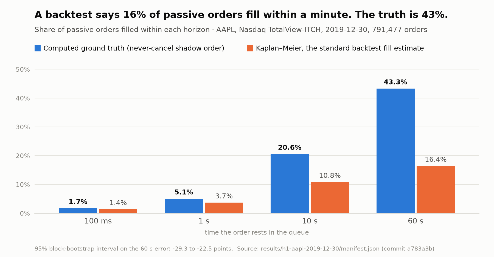
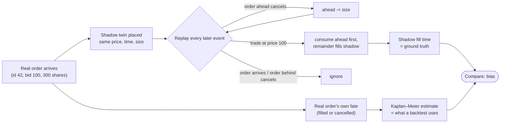
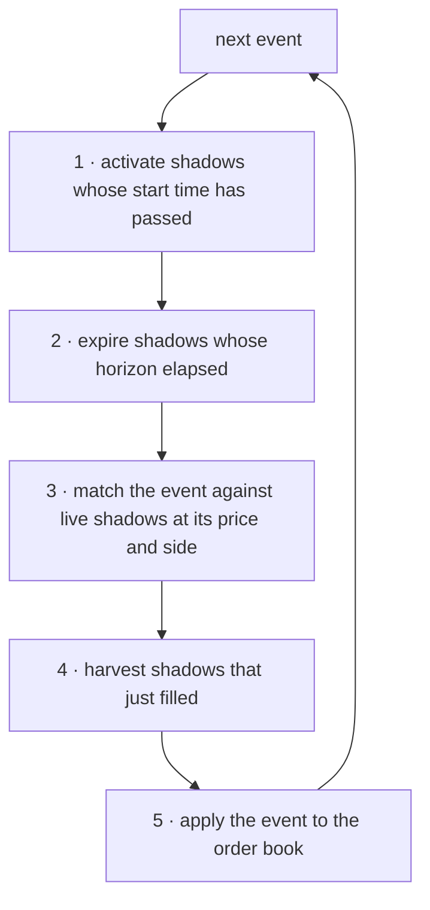
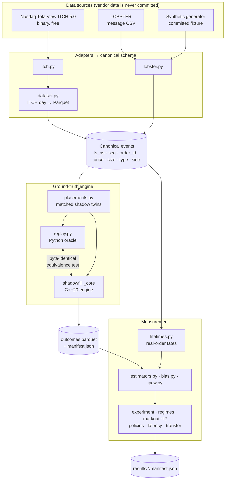

# ShadowFill

[](https://github.com/sakshamg251206/shadowfill/actions/workflows/ci.yml)


**How wrong are passive-fill backtests? Measured against a ground truth that is
computed, not modelled.**

ShadowFill replays real exchange order-by-order data and works out, by exact
arithmetic, whether a limit order that was *never actually sent* would have been
filled, and when. That number is a ground truth, so it can be used to grade the
fill models that trading backtests rely on. On one full day of Apple stock on
Nasdaq, the standard model says 16% of passive orders fill within a minute.
The computed answer is 43%.



<sub>Generated from <code>results/h1-aapl-2019-12-30/manifest.json</code> by
<code>scripts/plot_h1.py</code>; every number on it is read from that manifest.</sub>

This is a measurement project. It proposes no trading strategy and claims no
profit.

---

## Contents

- [The problem, in plain terms](#the-problem-in-plain-terms)
- [How it works](#how-it-works)
- [What was found](#what-was-found)
- [Why the numbers can be trusted](#why-the-numbers-can-be-trusted)
- [Features](#features)
- [Architecture](#architecture)
- [Tech stack](#tech-stack)
- [Project structure](#project-structure)
- [Getting started](#getting-started)
- [Configuration](#configuration)
- [Running the experiments](#running-the-experiments)
- [Using real data](#using-real-data)
- [What the output means](#what-the-output-means)
- [Testing](#testing)
- [Building and distribution](#building-and-distribution)
- [Key technical decisions](#key-technical-decisions)
- [Assumptions and limitations](#assumptions-and-limitations)
- [Future work](#future-work)
- [Further reading](#further-reading)

---

## The problem, in plain terms

A **limit order** is an offer to buy or sell at a fixed price, for example
"buy 100 shares at $289.70". It does not trade straight away. It joins a
**queue** of other orders at that price and waits; when sellers arrive, they
trade with the front of the queue first. Your order fills only once everyone
ahead of you has either traded or given up and cancelled.

Anyone building a trading strategy that uses limit orders tests it first on
historical data -- a **backtest**. And every such backtest has to answer one
question it cannot observe: *would my order have filled?* You cannot look it up,
because you never sent the order. So backtests use a **fill model**, an
educated guess. Those guesses are almost never checked against anything,
because there has been nothing to check them against.

The usual guess is borrowed from medical statistics. Look at the real orders
in the market, see how many filled before they were cancelled, and treat
cancellation like a patient leaving a clinical trial early (the
**Kaplan–Meier** estimator). That assumes people cancel orders for reasons that
have nothing to do with whether the order was going to fill. Traders do not
behave that way: they pull orders that look hopeless and keep the ones that
look promising, or the reverse. Either way, the guess is biased, and nobody
knew by how much.

## How it works

Some exchange data feeds -- called **market-by-order** or **L3** -- give every
order its own id and report every change to it: added, partly cancelled,
cancelled, traded. With ids, you can follow a queue exactly.

So place a hypothetical order, a **shadow**, into the historical queue. Do not
insert it into the book; just remember one number, **how many shares are ahead
of it**. Then replay the day:

| event in the data | effect on the shadow |
|---|---|
| an order **ahead** of the shadow is cancelled | `ahead` falls by the cancelled size |
| an order **behind** the shadow is cancelled | nothing |
| a new order arrives at the same price | nothing -- it joins *behind* the shadow |
| a trade happens at the shadow's price | it eats the front of the queue; whatever is left after `ahead` reaches zero **fills the shadow** |
| a hidden-order execution | nothing -- hidden orders never sat in the visible queue |

Because the shadow never cancels, its fill time is not estimated -- it is
**counted**. That is the ground truth.

To compare like with like, every real order in the data gets its own shadow
twin: same time, price, side and size. The twin is identical in every way
except that it never cancels. Comparing what Kaplan–Meier predicts for the real
orders with what actually happens to their twins measures the bias directly.



Inside the engine, each event is processed in a fixed order. Accounting runs
*before* the book applies the event, because deciding whether a cancelled
order was ahead of the shadow requires looking it up before it is deleted:



## What was found

AAPL on Nasdaq, 2019-12-30, regular hours: 1,581,219 events, 791,477 real
orders, each shadowed by a hypothetical order that never cancels. 95% intervals
from a block bootstrap over half-hour blocks *within* that session. The
research questions were written down before the data was looked at
([`docs/RESEARCH-SPEC.md`](docs/RESEARCH-SPEC.md)), and are reported whichever
way they came out.

| question | answer | verdict |
|---|---|---|
| Does treating cancellation as censoring bias the fill curve? (H1) | Kaplan–Meier says 16% of passive orders fill within a minute; the truth is **43%** | **yes**, every interval excludes zero |
| Does the sign depend on tick regime? (H2) | the sign flips for SAP, but not along the tick axis | **not supported** |
| Does adverse selection offset it? (H3) | the offset is absent; edge error is 0.056 bps at 60 s, all of it from the fill rate | **not supported** |
| What does an L2 feed cost? (H4) | even the expected-value L2 model promises **25%** more fills than it gets at 1 s; the three standard heuristics bracket the truth | **yes** |
| Does correcting the bias change the decision? (H5) | policy rankings do not invert (0 of 10 pairs) | **not supported** |
| Is it an artefact of assuming zero latency? | at 60 s the bias is −0.269 at 0 ms and −0.253 at 20 ms; at 1 s it flips sign | **headline robust** |
| Does standard reweighting (IPCW) fix it? | on queue position and order age, it removes 3% at 60 s | **no** |

Three of the five pre-registered hypotheses came back negative, and they are
reported as such. The effects they were meant to explain are large.

The headline, in one table -- fraction of passive orders filled within each
horizon:

| horizon | never-cancel truth | Kaplan–Meier | error | 95% CI |
|---|---|---|---|---|
| 100 ms | 0.0172 | 0.0140 | −0.0031 | [−0.0037, −0.0024] |
| 1 s | 0.0506 | 0.0372 | −0.0134 | [−0.0172, −0.0082] |
| 10 s | 0.2059 | 0.1085 | −0.0974 | [−0.1176, −0.0665] |
| 60 s | 0.4331 | 0.1644 | **−0.2688** | [−0.2925, −0.2253] |

**Why it understates.** Real orders are cancelled within seconds, so by 60 s
the orders still being watched are almost entirely ones nobody bothered to
pull -- and nobody pulls an order that was never going to fill. The survivors
are selected for *not* filling, and the estimator extrapolates their fill rate
to everyone. The cancelled orders would in fact have filled at nearly three
times that rate.

**Every experiment in full** -- tables, reasoning, negative results and the
command that reproduces each one -- is in **[docs/RESULTS.md](docs/RESULTS.md)**.
Every number traces to a committed manifest in [`results/`](results).

**What this is not.** One symbol and one day for most of it (six symbols for
H2). The intervals cover variation within that session, not between sessions.
The shadow order is assumed not to change anyone else's behaviour. Every
limitation is listed [below](#assumptions-and-limitations).

## Why the numbers can be trusted

A measurement tool is only useful if it can fail. Two tests are built to catch
a broken pipeline, and both run on every commit:

- **The placebo.** On a synthetic market where cancellation is random *by
  construction*, Kaplan–Meier is correct, so the measured bias must be zero.
  It reads −0.0000, −0.0002 and −0.0015 at 100 ms, 1 s and 10 s. The first
  version of this project measured **+0.26** here. The fault was the comparison
  design, not the arithmetic; it was fixed, and every number produced before
  the fix was withdrawn.
- **Known-bias injection.** A pipeline that always said "zero" would pass the
  placebo too. So a second test plants a cancellation bias with a known
  direction and requires the measurement to find it, with the right sign and
  growing with the injected strength. It does -- for one mechanism. For the
  opposite mechanism it does not, and the test pins that negative result rather
  than hiding it.

Beyond those, the engine exists twice: a short, readable Python implementation
that serves as the **oracle**, and a fast C++20 engine. A test holds them to
byte-identical output, field by field, on synthetic and real data.

```bash
make placebo     # if this fails, nothing else in the repository means anything
make injection
```

## Features

- **Ground-truth engine.** Exact queue-position accounting for hypothetical
  never-cancel orders over an order-by-order stream. Python oracle plus a C++20
  engine (pybind11) held to identical output; several hundred times faster
  than the oracle on the benchmark slice (CI gates at ≥ 200×).
- **Data adapters.** Nasdaq TotalView-ITCH 5.0 (binary, free and public) and
  LOBSTER (CSV), both normalised into one canonical event schema. ITCH days are
  parsed once and materialised as partitioned Parquet.
- **Estimators written out, not imported.** Kaplan–Meier, Aalen–Johansen
  cumulative incidence, inverse-probability-of-censoring weighting (IPCW) with
  baseline and time-varying covariates.
- **One runner per research question.** H1 (fill-curve bias), H2 (tick
  regimes), H3 (expected edge in basis points), H4 (level-2 ablation with three
  queue heuristics), H5 (does the decision change), plus a latency sweep, IPCW
  correction and cross-book transfer of a correction.
- **Honest uncertainty.** Paired block bootstrap over contiguous time blocks;
  too few blocks is an error, not a narrow interval.
- **Reproducibility by construction.** Every run writes a `manifest.json`
  pinning the git commit (flagged `-dirty` if the tree had uncommitted
  changes), the SHA-256 of its input, the full configuration, library versions
  and the compiler that built the engine.
- **Synthetic market generator.** Deterministic, seeded, with knobs that inject
  known cancellation biases. CI never touches third-party data.

## Architecture



**Responsibility boundaries.** `events.py` owns the schema and nothing else.
The adapters only translate a vendor format into canonical events.
`replay.py` owns book state and shadow accounting and knows nothing about
files. The C++ engine mirrors `replay.py`; if the two ever disagree, the Python
one is right by definition and the C++ one has the bug. Analysis modules never
replay the book themselves -- they call the engine and work on its outputs.

## Tech stack

| layer | tools |
|---|---|
| Engine | C++20, CMake ≥ 3.24, pybind11, Catch2 v3 |
| Analysis | Python 3.11+, NumPy, pandas, PyArrow / Parquet |
| Packaging | scikit-build-core (one `pip install` builds the C++ extension) |
| Testing | pytest, Catch2 |
| Quality | ruff (lint and format), mypy `--strict`, pre-commit |
| CI | GitHub Actions: lint, Python 3.11 / 3.12 / 3.13, C++ tests, throughput gate |

## Project structure

```
shadowfill/
├── src/
│   ├── shadowfill_core/          C++20 engine: order book and shadow tracker
│   └── shadowfill_bindings/      pybind11 module, imported as shadowfill._core
├── python/shadowfill/
│   ├── events.py                 canonical event schema
│   ├── replay.py                 Python oracle: book + shadow accounting
│   ├── itch.py · lobster.py      vendor adapters
│   ├── dataset.py                ITCH day → partitioned Parquet
│   ├── synthetic.py              seeded synthetic market, bias-injection knobs
│   ├── placements.py             shadow schedules (matched twins, time grid)
│   ├── lifetimes.py              real-order lifetimes from the event stream
│   ├── ground_truth.py           engine runner, writes outcomes + manifest
│   ├── estimators.py             Kaplan–Meier, Aalen–Johansen
│   ├── bias.py                   truth-vs-estimate comparison, block bootstrap
│   ├── experiment.py             H1 runner
│   ├── regimes.py                H2 runner
│   ├── markout.py                H3 runner
│   ├── l2.py                     H4 runner (L3 → L2 ablation)
│   ├── policies.py               H5 runner
│   ├── latency.py · ipcw.py · transfer.py   robustness and corrections
│   ├── provenance.py             git SHA, input hash, environment
│   └── databento_cost.py         optional cost guard for a paid vendor
├── tests/
│   ├── python/                   pytest suite: oracle, invariants, equivalence, gates
│   ├── cpp/                      Catch2 suite
│   └── fixtures/                 committed synthetic event stream
├── benchmarks/                   throughput gate
├── configs/                      run configurations
├── scripts/                      data download helpers, README chart
├── results/                      one committed manifest.json per run
└── docs/                         spec, results, decisions, amendments, plans
```

## Getting started

**Prerequisites:** Python 3.11 or newer, a C++20 compiler (developed and
tested with GCC 13), CMake ≥ 3.24. The C++ extension is compiled during
install.

```bash
git clone https://github.com/sakshamg251206/shadowfill.git
cd shadowfill
python -m venv .venv && source .venv/bin/activate

make install          # editable install with dev tools
# or, with the exact versions CI uses:
make install-locked
```

Run `make` on its own to list every target.

**A first run, with no downloads.** The repository ships a synthetic event
stream, so the whole pipeline runs out of the box:

```bash
# compute ground truth for shadows on a 100 ms grid at the best bid and ask
python -m shadowfill.ground_truth \
    --message-path tests/fixtures/synthetic_mbo_v1.csv \
    --out-dir results/synthetic-demo

# the full H1 measurement: truth vs Kaplan–Meier, with bootstrap intervals
python -m shadowfill.experiment \
    --message-path tests/fixtures/synthetic_mbo_v1.csv \
    --out-dir results/h1-synthetic \
    --horizon-ns 10000000000 --block-ns 2000000000 --no-window
```

The second command prints a table of truth against estimate per horizon and
queue-position stratum. The synthetic market's cancellations are random by
construction, so the error column should read near zero at short horizons.
The fixture spans only about 200 seconds, so ignore its 60 s rows: there the
truth curve has nothing left to observe and flattens, and the "error" measures
the end of the data, not the estimator.

## Configuration

Runs are configured with command-line flags; every runner supports `--help`.
`shadowfill.ground_truth` also accepts a flat `key: value` file, e.g.
[`configs/ground_truth_synthetic.yaml`](configs/ground_truth_synthetic.yaml).

No environment variable is needed to install, test or run on the fixture. The
optional ones are listed in [`.env.example`](.env.example):

| variable | used by | purpose |
|---|---|---|
| `SHADOWFILL_ITCH_DIR` | tests | where the `needs_itch` tests look for ITCH files (default `data/itch`) |
| `SHADOWFILL_ITCH_SAMPLE` | tests | one specific ITCH file to test against |
| `SHADOWFILL_ITCH_SYMBOL` | tests | symbol for the ITCH consistency test (default `UN`) |
| `SHADOWFILL_LOBSTER_DIR` | tests | where the `needs_lobster` tests look (default `data/lobster`) |
| `SHADOWFILL_REQUIRE_CORE` | tests, CI | `1` turns a missing C++ engine into an error instead of a skip |
| `DATABENTO_API_KEY` | `scripts/databento_probe.py` | optional paid vendor; never logged or written to a manifest |

## Running the experiments

Each research question has one command. All default to regular trading hours,
matched placement, seed 0 and 30-minute bootstrap blocks, and each writes
`manifest.json` next to its outputs.

| question | command |
|---|---|
| H1 — fill-curve bias | `python -m shadowfill.experiment --message-path $P --out-dir results/h1` |
| H2 — tick regimes | `python -m shadowfill.regimes --session-date 2019-12-30 --symbols AAPL,MSFT,SAP,INTC,UN,CSCO --out-dir results/h2` |
| H3 — expected edge | `python -m shadowfill.markout --message-path $P --out-dir results/h3` |
| H4 — level-2 cost | `python -m shadowfill.l2 --message-path $P --out-dir results/h4` |
| H5 — decision relevance | `python -m shadowfill.policies --message-path $P --out-dir results/h5` |
| latency sweep | `python -m shadowfill.latency --message-path $P --out-dir results/latency` |
| IPCW correction | `python -m shadowfill.ipcw --message-path $P --out-dir results/ipcw` |
| cross-book transfer | `python -m shadowfill.transfer --book AAPL=$P --book MSFT=$Q --out-dir results/transfer` |

where `$P` is a materialised session, e.g.
`data/parquet/date=2019-12-30/symbol=AAPL/events.parquet`. The exact commands
and flags behind every committed result are in [docs/RESULTS.md](docs/RESULTS.md)
and [docs/CURRENT-STATUS.md](docs/CURRENT-STATUS.md#10-reproduction-commands).

## Using real data

Nasdaq publishes complete TotalView-ITCH 5.0 trading days with no account, no
key and no charge, and the server honours HTTP range requests, so a prefix is
enough to validate the adapter without pulling 3.5 GB:

```bash
./scripts/fetch_itch_sample.sh 20      # first 20 MB of a day
pytest -m needs_itch -v
```

ITCH is the raw feed LOBSTER is itself derived from. Its `Order Executed`
message names the resting order that was consumed, which is what lets queue
position be computed rather than inferred; on a 20 MB sample, 1,569 of 1,569
executions resolved to a live order.

A full day is fetched in byte ranges (the server throttles long transfers),
verified, then parsed once and materialised so nothing downstream re-reads
3.5 GB of gzip:

```bash
./scripts/fetch_itch_parallel.sh 12302019.NASDAQ_ITCH50.gz data/itch
gzip -t data/itch/12302019.NASDAQ_ITCH50.gz

python -m shadowfill.dataset \
    --itch-path data/itch/12302019.NASDAQ_ITCH50.gz \
    --symbols AAPL,MSFT --out-root data/parquet
```

The LOBSTER path still works if you have a sample:

```bash
./scripts/fetch_lobster_sample.sh data/lobster
SHADOWFILL_LOBSTER_DIR=data/lobster pytest -m needs_lobster -v
```

Neither vendor's files are redistributed here, `data/` is git-ignored, and CI
touches neither.

## What the output means

`outcomes.parquet` holds one row per hypothetical order. Five terminal states:

| status | meaning |
|---|---|
| `FILLED` | the queue ahead was consumed and the order's full size traded |
| `EXPIRED` | still resting when its horizon elapsed |
| `TRUNCATED` | still resting, inside its horizon, when the data ran out |
| `NOT_ACTIVATED` | its effective timestamp fell past the last event |
| `RESTING` | in-flight only; never written |

Each row also records the first time the order's queue-ahead fell below 1000,
100, 10 and 1 shares (`ahead_lt_1000_ts` … `ahead_lt_1_ts`): its insert time if
it started below, `-1` if it never got that close to the front. Queue-ahead is
monotone, so these four times are its whole trajectory at that resolution; the
time-varying IPCW model is built on them.

`TRUNCATED` and `NOT_ACTIVATED` are kept apart deliberately. A truncated order
existed and we stopped watching, which is a censored observation. A
not-activated one never existed, and must not enter a fill-rate denominator.
Every numeric column of a `NOT_ACTIVATED` row is written as a Parquet null
rather than a sentinel, because a null propagates or raises downstream where a
`-1` silently regresses as a covariate. `first_fill_ts` and `full_fill_ts` do
stay `-1` on activated orders that never filled: that is a real observation
about an order that existed, not a missing one.

Three diagnostics go in every manifest:

- `unknown_order_events` — events referencing ids added before the recording
  window. Expected to be non-zero on real data, and not suppressed.
- `unknown_order_assumed_ahead` — times a queue was decremented on the
  unverifiable assumption that an absent id was resting ahead of the shadow.
  `assumed_ahead_events` reports the same thing per row, so "drop every order
  whose outcome leaned on an assumption and rerun" is a one-line filter.
- `fifo_violations` — executions that hit an order while one that arrived
  earlier was still resting at the same price and side. Zero on the synthetic
  fixture by construction; on real data a non-zero count means hidden
  liquidity, an order type this reconstruction does not model, or a gap in it.
  It is a statement about the data, never about a shadow order.

## Testing

```bash
make test         # Python suite, no external data needed
make test-cpp     # C++ engine, Catch2
make lint         # ruff check + ruff format --check + mypy --strict
make bench        # throughput gate (absolute events/s, developer hardware)
make placebo      # the falsification gate
make injection    # the planted-bias gate
make reproduce    # all of the above, then the synthetic ground-truth run
```

| what is tested | how |
|---|---|
| Queue arithmetic | hand-worked cases for every event type, tie, expiry and truncation rule |
| The invariants | checked on seeded synthetic streams: `ahead` never increases and never goes negative; hidden executions alone never fill anything; no output depends on a later event (prefix invariance); replay is deterministic |
| Two engines, one behaviour | Python oracle vs C++ engine, field by field, across seeds, all three L2 queue models, and real ITCH data |
| Estimators | hand-computed cases and known identities, e.g. IPCW with stratum-level censoring equals the size-weighted average of per-stratum Kaplan–Meier curves (Satten & Datta 2001), to 1e-12 |
| The pipeline as a whole | placebo (must read zero) and known-bias injection (must find the planted bias) |
| Adapters | ITCH binary layouts on synthetic bytes; real-sample tests marked `needs_itch` / `needs_lobster` |
| Throughput | C++ engine must be ≥ 200× the reference engine on the same slice in CI |

Tests that need vendor data are marked and skip cleanly without it. A skip is
never reported as a pass: the two `needs_lobster` tests are skipped, not
passing, because the LOBSTER sample is no longer published.

**Continuous integration** ([`.github/workflows/ci.yml`](.github/workflows/ci.yml))
runs lint, the Python suite on 3.11 (exact pins) and 3.12 / 3.13 (latest
releases within the declared ranges), the C++ suite and the throughput gate on
every push to `main` and every pull request. The equivalence tests are forced
to run there: a build without the C++ engine is an error, not a skip.

Pre-commit runs the same lint locally and refuses large files, so market data
cannot be committed by accident:

```bash
pre-commit install
```

## Building and distribution

There is no service to deploy: ShadowFill is a Python package with a compiled
extension, used as a library and as command-line tools. To use it on another
machine -- a research server, say -- install it there:

```bash
pip install .                 # builds the C++ engine and installs the package
pip wheel . -w dist           # or build a wheel for that platform
```

Building needs the same compiler and CMake as development. Results travel as
manifests: copy a run's `manifest.json`, check out its `git_sha`, obtain the
input whose SHA-256 it records, and rerun with its `config`.

## Key technical decisions

The full record, with the alternatives considered, is in
[docs/DECISIONS.md](docs/DECISIONS.md). The ones that shape everything:

- **A shadow shadows a real order.** Each shadow copies a real order's time,
  price, side and size, so truth and estimate describe the same population and
  differ only in cancellation. An earlier time-grid design compared different
  populations and failed the placebo.
- **The Python implementation is the oracle.** It optimises for being obviously
  correct (its best-price lookup is a deliberate linear scan); the C++ engine
  optimises for speed and is held to it.
- **Shadow accounting runs before the book update.** Otherwise a cancelled
  order could not be classified as ahead or behind.
- **Hidden executions never consume the visible queue.**
- **Ties go against the shadow.** An order arriving at exactly the shadow's
  timestamp counts as ahead; a hypothetical order has no sequence number, so the
  pessimistic reading is the honest one.
- **The bootstrap resamples contiguous blocks of time, never individual
  orders**, because order flow is autocorrelated; too few blocks raises an
  error.
- **Estimators are written out, not imported**, so every formula -- including
  tie handling -- is visible and tested.
- **The L2 ablation is a data transform, not a second simulator.** Strip the
  order id from every cancel and rerun the identical engine.
- **Manifests are committed; data is not.**

## Assumptions and limitations

**The shadow order does not change anyone else's behaviour.** Nothing here
models the market reacting to an order that was never sent. That is defensible
at small sizes and is not yet stress-tested; it is the assumption most likely
to matter.

**Trades through a better-priced shadow are not credited.** The engine matches
an execution against a shadow only at the shadow's own price. If the real
orders at that price are cancelled and an aggressor then trades through to a
worse price, the shadow -- which would have been first in line -- is not
filled. This can only *lower* the computed truth, so it makes the measured
understatements conservative. How often it happens has not been measured. It
is pinned by a strict `xfail` test and written up in
[docs/IDEAS.md](docs/IDEAS.md); fixing it changes every committed number, so
the fix must ship with a rerun.

**Orders whose ids predate the recording window are assumed to be ahead.** They
cannot be resolved either way. The count is reported per run and per row, so
the sensitivity of any result to the assumption is measurable rather than
hypothetical.

**Matched placement makes the populations identical, up to one known gap.**
Events sharing a timestamp can activate a shadow on a neighbouring event, so
about 10% of shadow/order pairs start with slightly different queue-ahead. A
test pins the exact-match share above 90%.

**Uncertainty is within-session only.** The bootstrap resamples blocks of time
within one session. Day-to-day variation needs more than one session and is not
covered by any interval reported.

**Book reconstruction from ITCH is validated less strongly than from
LOBSTER.** LOBSTER ships an orderbook file alongside its messages — a third
party's reconstruction of the same session — so the book could be checked row
by row against one this project did not build. Raw ITCH has no such file, and
cannot: ITCH is the input that file is derived from. What the ITCH path checks
instead is internal consistency — the book never crosses, every order reference
resolves on each of the six materialised symbols (0 unresolved, from a parse of
all 268,744,780 messages in the 2019-12-30 file), no removal exceeds the shares
resting — necessary rather than sufficient. The free LOBSTER sample is no longer
published, so this is a limitation of what is obtainable;
[docs/PLAN-AMENDMENTS.md](docs/PLAN-AMENDMENTS.md) §V.1 records it in full.

**The synthetic fixture is a model, not a market.** Executions respect
price-time priority, but adds outpace cancels, so the book deepens through a
long run and the process is non-stationary. It exists so CI never depends on
third-party data and so the censoring mechanism is known by construction. No
claim in this repository rests on it.

**Nothing here is a trading strategy.** It reports whether a hypothetical
passive order would have filled and when. It never claims PnL.

## Future work

In priority order, from [docs/CURRENT-STATUS.md](docs/CURRENT-STATUS.md):

1. **A second session.** Re-run H1–H5 on another day, converting the
   within-session bootstrap into the across-session comparison the spec
   pre-registered. A second day's file has been fetched and verified
   (amendment AE); no result from it is reported yet.
2. **Size the trade-through gap**, then fix it in both engines and rerun.
3. **Investigate SAP's sign reversal** in H2 -- the most interesting open
   question; venue fragmentation of cross-listed names is the obvious candidate,
   not a finding.
4. **Impact stress test** for the no-reaction assumption.
5. **The remaining estimators** from the spec: cause-specific Cox, Fine–Gray,
   dependent-censoring bounds and an ML hazard baseline.

## Further reading

| document | what it holds |
|---|---|
| [docs/RESULTS.md](docs/RESULTS.md) | every experiment in full, with reproduction commands |
| [docs/RESEARCH-SPEC.md](docs/RESEARCH-SPEC.md) | the problem, the pre-registered hypotheses, evaluation design |
| [docs/DECISIONS.md](docs/DECISIONS.md) | methodological decisions and why |
| [docs/PLAN-AMENDMENTS.md](docs/PLAN-AMENDMENTS.md) | every deviation from plan, dated, with its reason |
| [docs/CURRENT-STATUS.md](docs/CURRENT-STATUS.md) | where the project stands, reproduction commands, runtimes |
| [docs/IDEAS.md](docs/IDEAS.md) | known gaps and ideas outside the current plan |
| [docs/plans/](docs/plans) · [docs/specs/](docs/specs) | the implementation plans the code was built from |
